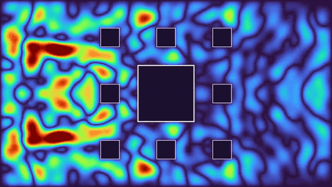

# Ph213F-FinalProject

This repository contains two standalone 2D finite-difference wave simulations. `CarpetSim.py` models a wave interacting with a square Sierpinski-style carpet obstacle, and `TriangleSim.py` models the same wave system with triangular fractal obstacles.

Both scripts render MP4 animations with Matplotlib and FFmpeg. They support automatic CPU/GPU backend selection: by default, the scripts check whether CuPy can see a CUDA-capable GPU and use it when available; otherwise they fall back to NumPy.

## Example Outputs

### EOYS Video

[](Videos/EOYS_FINAL.mp4)

[Watch the full EOYS MP4](Videos/EOYS_FINAL.mp4)

## Project Setup

Requirements:

- Python 3.11, matching `.python-version` and `pyproject.toml`
- NumPy and Matplotlib
- CuPy with CUDA 12.x support for GPU acceleration
- FFmpeg available on `PATH` for MP4 output

Install dependencies with `uv`:

```bash
uv sync
```

If managing packages manually, install at least:

```bash
pip install numpy matplotlib cupy-cuda12x
```

Install FFmpeg separately, for example:

```bash
sudo apt-get install ffmpeg
# or
brew install ffmpeg
```

## Running the Simulations

Run the carpet simulation:

```bash
uv run python CarpetSim.py --n 4 --mp4-fname carpet_n4.mp4
```

Run the triangle simulation:

```bash
uv run python TriangleSim.py --n 2 --mp4-fname triangle_n2.mp4
```

Select the compute backend with `--compute`:

- `--compute auto`: default; use CuPy if a CUDA device is available, otherwise NumPy.
- `--compute cpu`: force NumPy CPU execution.
- `--compute gpu`: require CuPy/CUDA and exit with an error if unavailable.

Quick CPU smoke test without saving video:

```bash
uv run python CarpetSim.py --compute cpu --N 120 --T 0.1 --no-save-mp4
```

## Common CLI Arguments

Both scripts expose the same main simulation controls:

| Argument | Default | Description |
| --- | --- | --- |
| `--N` | `540` | Grid size, as an `N x N` domain. |
| `--n` | `1` | Fractal depth level. |
| `--base-len` | `0.3` | Base obstacle size in domain units. |
| `--Lx`, `--Ly` | `16/9`, `1.0` | Physical domain dimensions. |
| `--c` | `1.0` | Wave speed. |
| `--CFL` | `0.45` | CFL safety factor for the timestep. |
| `--T` | `6.0` | Total simulated time. |
| `--sponge-thickness` | `28` | Boundary damping layer thickness in cells. |
| `--sponge-strength` | `2.0` | Boundary damping strength. |
| `--mp4-fname` | script-specific | Output video path. |
| `--fps` | `60` | Output video frame rate. |
| `--steps-per-frame` | `4` | Simulation timesteps per rendered frame. |
| `--pulse-x`, `--pulse-y` | `0.22`, `0.50` | Initial pulse center. |
| `--pulse-sigma` | `0.03` | Initial Gaussian pulse width. |
| `--pulse-amp` | `1.0` | Initial pulse amplitude. |
| `--compute` | `auto` | Backend selection: `auto`, `cpu`, or `gpu`. |
| `--save-mp4`, `--no-save-mp4` | save enabled | Enable or disable MP4 writing. |

Use `--help` on either script for the complete argument list.

## Notes

The wave field is shown with `COLOR_MODE = "height"` by default, which renders `|u(x, y, t)|`; set it to `"signed"` in the script to visualize signed displacement. `COLORMAP` controls the Matplotlib color map. Rendering still uses FFmpeg `libx264`, even when simulation math runs on the GPU.

## 3. References

```
H. P. Langtangen and S. Linge, *Finite Difference Methods for Wave Equations*. Center for Biomedical Computing, Simula Research Laboratory, 2016. 
```

```
J. Davidov, “Prompt to ChatGPT 5.1 requesting README.md generation,” ChatGPT 5.1 (large language model), OpenAI, prompt: “Can you write a README.md file for the repository containing the previous code in markdown formatting describing the following: -- 0. Description of the final 1. Setup of the project environment 2. Running the code and available input arguments 3. References (leave empty) --”, Dec. 2, 2025.
```

```
J. Davidov, “Codex session requesting README.md updates for CuPy backend selection and embedded simulation videos,” Codex (coding agent), OpenAI, prompt: “Can you rewrite the README.md file to accomodate these changes to the scripts? Do not alter the references already present in the README.md file, however add a reference to this Codex session in a similar style to the already present GPT citation. Also, can you add embeds for Videos/Triangle_n2.mp4 and Carpet_N4.mp4 into the new README.md file?”, Aug. 24, 2026.
```

## 8. Disclaimer

This `README.md` file is slop, as it was auto-generated by ChatGPT 5.5 high during my last Codex session.
